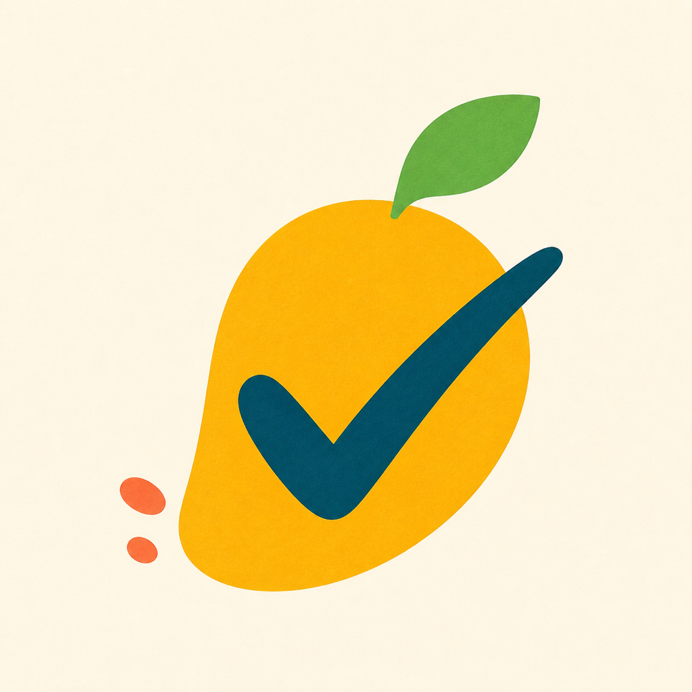

<div align="center">
  
  <h1>Guozai Day</h1>
  <p>Turn everyday effort into a garden you can see grow.</p>
  <p><strong>An iPad-first, iPhone-compatible growth journal for everyday life</strong></p>
</div>

<p align="center">
  <a href="README.md">简体中文</a> · English
</p>

## What is Guozai Day?

Guozai Day is an everyday growth app designed for a child and their family. A child can see what to do today, complete tasks with a tap or a swipe, record actual reading or exercise time, and reflect on their mood and day. Parents maintain long-term plans, leave encouragement, review patterns, and manage the family's data.

The app does not turn habit building into another report card. There are no coin balances, deductions, leaderboards, or streak-loss punishments. What matters is helping a child begin, keep going, and notice the small steps that would otherwise be easy to forget.

## Core experience

### 🌤 A clear plan for today

- Required and optional tasks are presented separately, so today's plan is easy to understand.
- Tasks can be checked off with a checkbox or crossed out with a horizontal finger gesture.
- Reading, exercise, and practice tasks can store both a target and the actual amount completed.
- A child can add a personal challenge to today's plan.
- Each completed task triggers specific, process-focused praise with a short, cheerful sound.

### 🌱 Grow effort into a garden

Completing every required task for the day records a Daily Achievement and grows the current plant by one step. A complete cycle has 28 steps, moving from seed to sprout, seedling, young tree, and finally a flourishing tree before the next one begins.

The Growth Garden rewards accumulation, not perfect continuity. Missing a day does not make the plant wither or trigger a punishment animation.

### 🏅 Warm rewards without an economy

The reward system has three parts:

| Reward | How it is earned | What it represents |
| --- | --- | --- |
| System badge | Reaching a clear, explainable growth milestone | Remembering first steps, consistency, exploration, and returning |
| Special badge | Granted by a parent for a specific moment | Preserving progress that a parent genuinely noticed |
| Weekly wish | Chosen by the child and unlocked after 5 Daily Achievement days in a week | Giving the child meaningful choice instead of selling rewards for points |

Weekly wishes run from Monday through Sunday. The 5 achieved days do not need to be consecutive, and at most one wish can be unlocked per week. If a wish is not unlocked, it carries over gently, and the child can choose a different one later.

### ✨ See a personal growth story

The child-facing Growth area includes:

- A 365-day Growth Star Map.
- A monthly view across six growth areas: learning, reading, exercise, self-care, family responsibility, and exploration.
- Daily details for tasks, completed amounts, mood, self-rating, proud moments, and parent encouragement.
- Weekly highlights, achieved-day history, and Growth Garden progress.

Parents can review trends, growth-area distribution, a date-by-area matrix, and period comparisons. Every comparison is against the child's own past, never against other children.

### 👨‍👩‍👦 Parents support without taking over

The Parent Center can:

- Create, edit, pause, or disable recurring task templates.
- Configure task reminders, morning plan reminders, and evening reflection reminders.
- Review and correct historical records, then add encouragement.
- Create wishes, grant special badges, and confirm reward collection.
- Review growth analytics, export data, and restore a backup.

## Data and privacy

- No account, server, or CloudKit dependency is required.
- Tasks, reflections, badges, and wishes are stored locally with SwiftData.
- Parents can export a versioned, plaintext JSON backup.
- Task records, daily summaries, quantity records, and badge records can also be exported as CSV.
- Files can be saved to Files or iCloud Drive through the system file picker. This is not automatic cloud sync.
- Imports are validated and previewed first, then merged by stable identifiers without silently overwriting existing records.

> Exported JSON and CSV files are plaintext and may contain a child's growth records. Store them carefully.

## Platforms and accessibility

- iOS and iPadOS 17 or later.
- The in-app interface is currently Chinese.
- Sidebar navigation on iPad and tab navigation on iPhone, with portrait, landscape, and split-view support.
- Dynamic Type, VoiceOver, Increase Contrast, and Reduce Motion support.
- Large touch targets for common child-facing actions, with haptic, visual, and sound feedback for check-ins.

## Run the app

Requirements: Xcode 16.4 or later.

```bash
git clone git@github.com:goby-ao/better-guozai.git
cd better-guozai
open GuozaiDay/GuozaiDay.xcodeproj
```

In Xcode, select the `GuozaiDay` scheme and any iPad or iPhone running iOS 17 or later. On first launch, the app creates a local Guozai profile with a set of editable sample tasks.

Run the domain and data tests:

```bash
cd GuozaiDay
swift test
```

## Project structure

```text
GuozaiDay/GuozaiDay/          SwiftUI app, design system, and feature screens
GuozaiDay/GuozaiCore/         Independently testable domain rules
GuozaiDay/GuozaiDayTests/     SwiftData and backup integration tests
GuozaiDay/GuozaiDay.xcodeproj iPhone and iPad Xcode project
design-previews/              App icon explorations and alternatives
docs/                         Product and technical decision documents
```

Learn more:

- [Product language and domain model](CONTEXT.md)
- [Visual and interaction design system](DESIGN.md)
- [Implementation plan](docs/IMPLEMENTATION-PLAN.md)
- [Development and verification guide](GuozaiDay/README.md)
